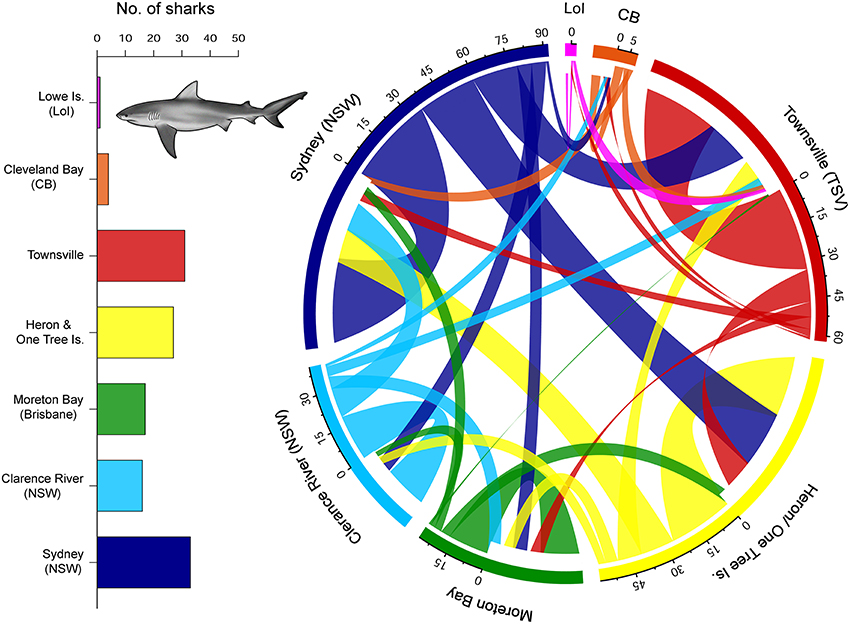
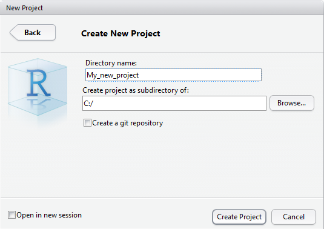
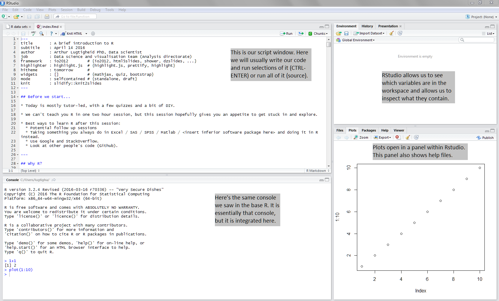
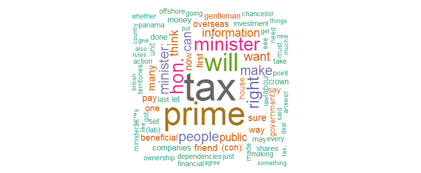
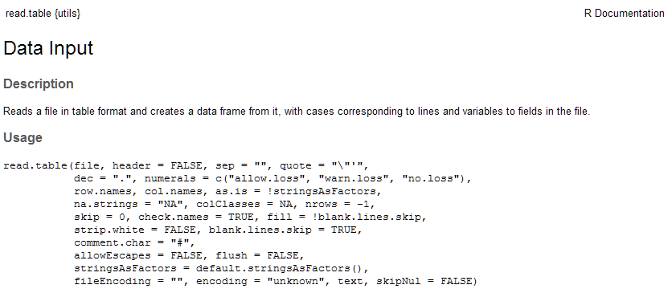
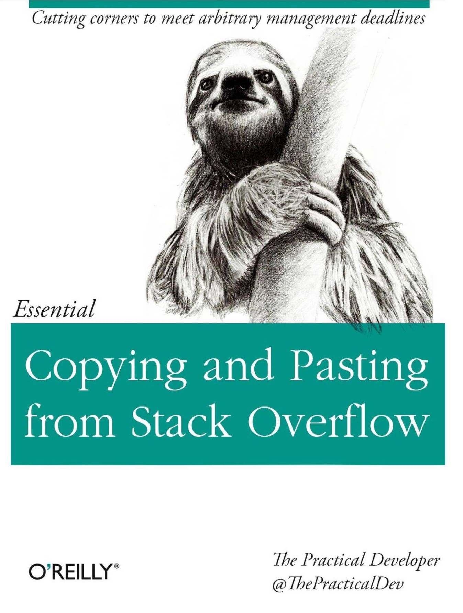

## Before we start...

* I can't teach you much in an hour...

* This session focusses on:
  * A very simple working example
  * Best practice for working with R and Rstudio
  * Resources for further learning and where to get help

---

## Why R?

* **R is free** (["free" as in "free speech", not as in "free beer"](https://en.wikipedia.org/wiki/Gratis_versus_libre#.22Free_beer.22_vs_.22free_speech.22_distinction)).
* Extremely popular in academic, enterprise, and increasingly government circles.
* Adopted by Microsoft in the latest version of SQL server (2016).
* Can talk to Hadoop and Spark (two very popular 'big data' technologies).
* Supported by an enormous and active community.
* Extremely extensible.

---



<br />

<p style="text-align: center">Good luck making something like this in SAS / SPSS / Excel / Matlab!</p>

--- .intermezzo

## Getting started on a project

* Setting up
* Dependency control
* Making it reproducible

---

## Setting up a project

* Use RStudio projects instead.
  * Avoids use of `setwd()`.
  * Essential for advanced functions of RStudio.
  * File > New Project...
  
  

---

## Dependency control

* R is constantly under development
* Packages are constantly under development too
* You may use 50 packages from 50 different authors.
* Therefore it is important to keep records of which package versions you use for each project.

---

## Dependency control

```{r}
.libPaths()
```

---

## Dependency control

```{r}
sessionInfo()
```

---

## Dependency control

### The better way

```{r, eval=FALSE}

# Install and load the checkpoint library

install.packages("checkpoint")
library(checkpoint)

# Set a checkpoint for the project

checkpoint("2016-05-22", use.knitr = TRUE)

# Subsequently, you can load this snapshot with:

setSnapshot("2016-05-22")

```

Watch your disk space! Some packages will need to be installed manually.

---


## Reproducibility

* Code is for People (Not Computers).
* In 3 months time, even you will need comments.
  * Comment __why__ not how:
  
```
# This is a comment
```
* Can you use a reproducible format?

---

## Reproducibility

### Markdown

* Blends text, tables, figures...everything into a single document
* This presentation is written using markdown.

> Lorem ipsum dolor sit amet, consectetur adipiscing elit. Ut ornare dui urna, vel facilisis eros molestie in. Duis finibus eros sem, sodales luctus neque iaculis eget. Nam a fringilla massa. Sed sed dictum sapien.
>
>```{r}
>
># Plot for demonstration purposes
>
>plot(rnorm(100))
>
>```

--- .intermezzo

## Walking through a project


* Getting the data in
* Manipulating data

--- 


--- .intermezzo

## The R environment

* Base R
* Rstudio

--- 

## Base R console


---

## RStudio



--- .intermezzo

## Working with objects and functions

* assignment
* data types
* the workspace
* functions and arguments

---

## Assignment 

Everything in R is an object


--- .intermezzo

## Loading data and getting libraries

* loading data
* libraries

--- .intermezzo

## Rstudio Projects and getting help

* Rstudio projects
* Getting help in R

--- 

### Base R console


---

### RStudio


---

## Installing and using packages

One of the strengths of R is that there are literally thousands of packages available for you to extend the core capabilities of the R statistical environment. 

```{r eval=FALSE}
# This installs the wordcloud package from CRAN
install.packages('wordcloud')
``` 

Then to use the package, you have to load it through the library command:

```{r, eval=FALSE}
library(wordcloud)

wordcloud(
  panama,            # this is data I mined from the common's hansard records
  scale=c(5,0.5), 
  max.words=100, 
  random.order=FALSE, 
  rot.per=0.35, 
  use.r.layout=FALSE, 
  colors=brewer.pal(8, 'Dark2')
  )
```

---

## Installing and using packages *(Cont.)*

And here are the 100 most used words in the House of Commons debate on the Panama papers (Mon 14 April 2016) represented as a word cloud:



---

## Getting help

Every function has a help function with syntax and examples:

```{r}
?read.csv
```

<div style="border: 1px solid #ccc; width: 100%; backgorund-color: #fff; padding: 10px 0;">
  
</div>

---

## Helping yourself

There is a plethora of general help books available:
<br />
<div style="display: block; margin-left: auto; margin-right: auto">


</div>

---

## Helping yourself

If that doesn't work:
<br />

<div style="display: block; margin-left: auto; margin-right: auto">

</div>

--- .intermezzo

## Best practice for using R and Rstudio

* Commenting and clarity
* Rstudio
* Keep it reproducible
* Avoiding dependency hell
* Version control

---

## Some best practices

Rule 1: always comment __everything__ you do.

```{r, eval=FALSE}
1+1        # here's a comment
```

Rule 2: Choose sensible names for variables, no reserved words

```{r, eval=FALSE}
# this is a reserved word, a word that is part of R syntax
with <- 2

# bad
howdoyoulikereadinglongvariablenameswithoutspaces <- 1
ai <- 27000

# invalid
spaced out variable <- 1
5experiment <- 0

# good
annual.income <- 27000
```

---
  
## A brief style guide (Cont.)

Rule 3: use proper indentation

```{r eval=FALSE}
# readable
plot(
     x = x,
     y = y,
     type = "l",
     col = "black"
     )

# Not very readable
plot(x=x,y=y,type="l",col="black")
```

---

## A brief style guide (Cont.)

Rule 4: When we call a function, we usually use the keywords for clarity.

```{r}
seq(
     from = 1,
     to = 10,
     by = 1
     )
```

We don't have to use keywords - this is called lazy loading.

```{r, eval=FALSE}
seq(1, 10, 1)
```

Generally, using keywords increases readability of code. 

More guidance: https://github.com/hadley/devtools/wiki/Style


## Everything in R is an Object!

All the data, the analyses, and even plots you use and create are, or can be, objects; an object can be a combination of variables, functions, and data structures.

```{r}
# You assign a new object with <-
a <- 1       # also: 1 -> a
```

To change the value of an object you *have* to reasign it

```{r, eval=FALSE}
a + 1        # we increment a by one

a            # what's the value of a?

a == 1       # we can also test whether object a is still 1
```

---

## Numbers and strings (scalars)

The simplest object type in R is a scalar. A scalar object is just a single value like a number or a name. We already defined several scaler objects. Here are examples of numeric scalars:

```{r, eval=FALSE}
a <- 100
b <- 3 / 100
```

Scalars don't have to be numeric, they can also be characters (also known as strings). 

```{r, eval=FALSE}
d <- "Sheffield"
e <- "Department for Business, Innovation and Skills"
f <- "1"

# what is the result of this?
f + 1
```

---

## Vectors

A vector object is just a combination of several scalars stored as a single object. 

```{r}
# let's create a vector called 'vec'
vec <- c(4, 8, 15, 16, 23, 42)
char.vec <- c('Ceci', 'N\'est', 'pas', 'une', 'pipe')
```

To select elements from a vector, we use indices:

```{r eval=FALSE}
# the second element in vec
vec[2]

# the second to fourth element of vec
vec[2:4]

# the second element of the char.vec
char.vec[2]

```

---

## Vectors

Logical indexing is a powerful way to select elements.

```{r}
# let's create a vector called 'num'
num <- seq(3,19,3)

num < 5   # we call this a boolean vector

num > 10

filter <- num > 10
num[filter]


```

--- .quiz

## Vector functions

```{r}
a <- 1:5
b = seq(
  from=1,
  to=10,
  by=1)

# what do these contain?
ab.sum = a+b
ab.prod = a*b

length(a)
sd(b)

```

## Matrices and data frames

Matrices and data frames are very similar to excel spreadsheets. Matrices can only contain either character or numeric values, data frames can be a mix. Most real-world data you encounter in R will be saved as a data frame.


---

## Matrices


```{r}
# create a matrix
foo <- matrix(1:9, nrow=3, ncol=3)
```

```{r, echo=FALSE}
foo
```

```{r, eval=FALSE}

# we use 2D indices to select data 
foo[r,c]

# we can select one entire row
foo[r, ]

# and we can select one entire column
foo[ ,c]
```

```{r}
foo[2, ]
```

---

## Data frames

```{r}
tax.mp <- data.frame(
    "sex" = c('M', 'M', 'M', 'M', 'F'),
    "Party" = c('Con', 'Con', 'Lab', 'Con', 'SNP'), 
    "Name" = c('Cameron', 'Osborne', 'Corbyn', 'Johnson', 'Sturgeon'),
    "Income" = c(200307, 198738, 70795 , 612583, 104000),
    "Tax" = c(75898, 72210, 18912, 276505, 31000)
    )

str(tax.mp)     # let's look at the structure
```

---

## Data frames

```{r}
class(tax.mp)

summary(tax.mp)

head(tax.mp, 2)
```

---

## Accessing column and row names

```{r}

colnames(tax.mp)

colnames(tax.mp)[2]

rownames(tax.mp)

ncol(tax.mp)

```

---

## Selecting data from a data.frame

```{r}
tax.mp$Income        # tax.mp$Income[2]
tax.mp[2, c('Income', 'Tax')]
subset(tax.mp, Income > 180000, select = c('Name','Party', 'Income'))
```

---

## Creating new columns

```{r}
# How much 
tax.mp$taxrate <- (tax.mp$Tax / tax.mp$Income) * 100

# let's see what that did
tax.mp$taxrate

# alternatively
with(tax.mp, Tax / Income)

```

---

## Data wrangling with dplyr

```{r}
library(dplyr)

# filter the fligths on the first day of the year
filter(tax.mp, Party == 'Con', taxrate > 40)

# add columns
mutate(tax.mp, gain = Income - Tax)

```

---

## Piping commands together

```{r}

tax.mp %>%                  # Specify original dataframe
  group_by(Party) %>%         # Grouping variable
    summarise(
      a = mean(Income),           # calculate mean of column income in tax.mp
      b = min(Income),             # calculate sd of column col.b in my.df
      c = max(Tax)                # calculate max on column col.c in my.df, ...
    )


```

--- .intermezzo

## Managing data

* The workspace
* Reading data
* Writing data

---

## The R Workspace

The workspace (aka your working environment) represents all of the objects and functions you have either defined in the current session, or have loaded from a previous session.

```{r, eval=FALSE} 
getwd()                     # Returns the current working directory
setwd(file = )              # Changes the working directory to a specified file location
list.files()                # Returns a vector of all files and folders in the working

ls()                        # Display all objects in the current workspace
rm(a, b, ..)                # Removes the objects a, b... from your workspace
rm(list = ls())             # Deletes all objects in your workspace

load(file = "myimage.RData")            # Loads a stored workspace called "myimage.RData" from disc.
write.table(x, file = "mydata.txt")     # Saves the object x as a text file called "mydata.txt" to the working directory
read.table(file = "mydata.txt")         # Reads a text file called "mydata.txt" in the working directory into R
```

---

## Importing data into R

```{r}
titanic <- read.table(
     "https://vincentarelbundock.github.io/Rdatasets/csv/datasets/Titanic.csv",
     header = T
     )

head(titanic, 5) # what does tail(titanic) do?

class(titanic)

```

---

## Writing out data

Writing out files is incredibly simple. 

```{r, eval=FALSE}
write.table(
  x = titanic, 
  file = "titanic_subset.csv", 
  row.names = FALSE,
  sep = ','
  )
```

Or if you want to save your workspace:

```{r, eval = FALSE}

# saves the workspace to .Rdata
save.image()

# Saves it somewhere else
save(titanic, trees, file="my.Rdata")

```

---

## Other formats you can import into R

* Data files
  * Excel sheets
  * SPSS files
  * SAS files (not great)
  * STATA files
  * XML / JSON output
  
* Databases
  * *SQL / SQLlite / Access
  * *NoSQL / MongoDB / Hadoop

And this is just the beginning...

--- .intermezzo

## Getting our hands dirty

In this session we're going to quickly look at a data set that's built into R and use a couple of basic R commands to see what it looks like. 

* The IRIS data set
* Characteristics of a data set
* Plotting the data
* Simple statistics

---

## The IRIS data set

*?iris*. This famous (Fisher's or Anderson's) iris data set gives the measurements in centimeters of the variables sepal length and width and petal length and width, respectively, for 50 flowers from each of 3 species of iris.

```{r}
head(iris,3)    # returns the first 3 records; what does tail(iris, 3) do?
dim(iris)       # the number of dimensions of the data set
```

The first element is the number of rows; the second is the number of columns.

---

## The IRIS data set

How are the data structured?

```{r}
str(iris)
```

try it yourself:

```{r, eval=FALSE}
attributes(iris)
```

---

```{r}
attributes(iris)
```

```{r, eval=FALSE}
attrib.iris <- attributes(iris)
```

---

```{r}

# What is the mean petal width?
mean(iris$Petal.Width)

# What was the longest sepal?
max(iris$Sepal.Length)

# How many flowers were there in each group?
table(iris$Species)
```

---


```{r}
# what is the average sepal width per specie?
aggregate(
  formula = Sepal.Width ~ Species,
  data = iris,
  FUN = median
)
```

Note, the equivalent SQL query (you can use the sqldf package for this in R):

<br />

```
SELECT Species, median(Sepal.Width) from iris GROUP BY Species
```

---

## Plotting the IRIS data

```{r, fig.height=6}
plot(iris$Petal.Length, iris$Petal.Width, main="Edgar Anderson's Iris Data")
```

---

## Plotting the IRIS data

```{r, fig.height=6}
plot(iris$Petal.Length, iris$Petal.Width, col=iris$Species, main="Edgar Anderson's Iris Data")
```

---

## Plotting the IRIS data

```{r, fig.height=6, fig.width=8}
plot(iris[1:4], col=iris$Species)
```

---

## Some very simple trend analyses

```{r, fig.height=5, fig.width=5, echo=FALSE}
plot(iris$Petal.Length, iris$Petal.Width, col=iris$Species)
```

```{r}
lsfit(iris$Petal.Length, iris$Petal.Width)$coefficients
```

---

## Some very simple trend analyses

```{r,  fig.height=5, fig.width=5}
plot(iris$Petal.Length, iris$Petal.Width, col=iris$Species)
abline(lsfit(iris$Petal.Length, iris$Petal.Width)$coefficients, col="black")
```

---

## Usually we use the lm() function..

```{r}
model <-lm(Petal.Width ~ Petal.Length, data=iris) 
summary(model)
```

---

## Hypothesis testing

```{r, fig.width=8, fig.height=4}
boxplot(Sepal.Width ~ Species, iris)
```

Looks like the versicolor and virginica flowers' sepal width may be identical. 

---

## Hypothesis testing (t-test)

Is there any real difference between the mean sepal width of the versicolor and virginica flowers? 

```{r}
t.test(Sepal.Width ~ Species, iris, Species %in% c('versicolor', 'virginica'))
```

---

## Hypothesis testing (ANOVA)


Is there any real difference between the mean sepal widths of all groups?

```{r}
# run the model
plant_aov <- aov(Sepal.Width ~ Species, iris)

# show the anova table
anova(plant_aov)
```


