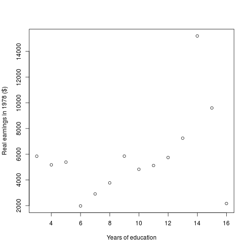
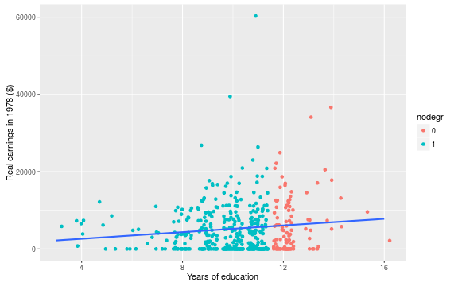
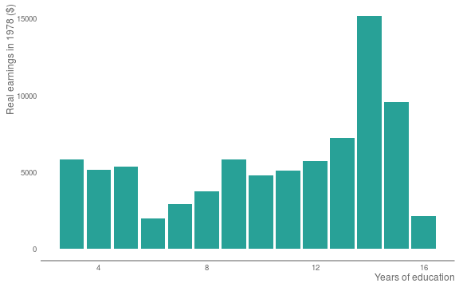

<style>

em {
  font-style: italic;
}

strong {
  font-weight: bold;
}

</style>

## Before we start...

* I can't teach you much in an hour...

* This session focusses on:
  * Some high level advice you might not hear elsewhere.
  * A very simple walthrough.
  * Some advice for the future and where to get help.

---

## Why R?

* R is free (["free" as in "free speech", not as in "free beer"](https://en.wikipedia.org/wiki/Gratis_versus_libre#.22Free_beer.22_vs_.22free_speech.22_distinction)).
* Growing popularity (part of SQL server 2016).
* Can talk to Hadoop and Spark (two very popular 'big data' technologies).
* Supported by an enormous and active community.


```r
# CRAN 'vetted' packages
install.packages("dplyr")
library(dplyr)

# Packages on github
devtools::install_github("ivyleavedtoadflax/govstyle")
# or in DfE: download the zip
devtools::install_local("C://govstyle-master.zip")
```

--- .intermezzo

## Getting started on a project

(Some important things you may have never thought about)

* Setting up
* Dependency control
* Making it clear and reproducible

---

## Setting up a project

* Use RStudio projects instead.
  * Avoids use of `setwd()` - required for advanced functionality.
  * File > New Project...
  
  

---

## Dependency control

* R is constantly under development (as are packages).
* Changes to packages __can__ break your code.
* __Avoid dependency hell__ with a little planning.

The simplest way: record system info for each project.


```r
.libPaths()
```

```
## [1] "/home/matthew/R/x86_64-pc-linux-gnu-library/3.3"
## [2] "/usr/local/lib/R/site-library"                  
## [3] "/usr/lib/R/site-library"                        
## [4] "/usr/lib/R/library"
```

---

## Dependency control


```r
# Which exact packages are used?
sessionInfo()
```

```
## R version 3.3.0 (2016-05-03)
## Platform: x86_64-pc-linux-gnu (64-bit)
## Running under: Ubuntu 14.04.4 LTS
## 
## locale:
##  [1] LC_CTYPE=en_GB.UTF-8       LC_NUMERIC=C              
##  [3] LC_TIME=en_GB.UTF-8        LC_COLLATE=en_GB.UTF-8    
##  [5] LC_MONETARY=en_GB.UTF-8    LC_MESSAGES=en_GB.UTF-8   
##  [7] LC_PAPER=en_GB.UTF-8       LC_NAME=C                 
##  [9] LC_ADDRESS=C               LC_TELEPHONE=C            
## [11] LC_MEASUREMENT=en_GB.UTF-8 LC_IDENTIFICATION=C       
## 
## attached base packages:
## [1] stats     graphics  grDevices utils     datasets  methods   base     
## 
## other attached packages:
## [1] dplyr_0.4.3
## 
## loaded via a namespace (and not attached):
##  [1] Rcpp_0.12.5      codetools_0.2-14 digest_0.6.9     assertthat_0.1  
##  [5] R6_2.1.2         DBI_0.4-1        formatR_1.4      magrittr_1.5    
##  [9] evaluate_0.9     stringi_1.1.1    whisker_0.3-2    tools_3.3.0     
## [13] stringr_1.0.0    markdown_0.7.7   yaml_2.1.13      parallel_3.3.0  
## [17] slidify_0.5      knitr_1.13.1
```

---

## Dependency control

A better system for handling dependencies (in most cases).


```r
# Install and load the checkpoint library

install.packages("checkpoint")
library(checkpoint)

# Set a checkpoint for the project

checkpoint("2016-05-22", use.knitr = TRUE)

# Subsequently, you can load this snapshot with:

setSnapshot("2016-05-22")
```

Some packages will need to be installed manually. Watch your disk space!

---

## Reproducibility and Clarity

**The Past is a foreign country, they do things differently there**

* Code is for People (Not Computers).


```r
hard_to_read <- function(x) ifelse(x == 0, NA, x)
```

* Make things readable.
* `# Comment liberally`.


```r
# Function to replace zero values with NA

better <- function(x) {
  
  ifelse(x == 0, NA, x)
  
}
```

---

## Reproducibility and Clarity

* Be explicit (at least to begin with).


```r
# Function to replace zero values with NA

best <- function(x) {
  
  ifelse(
    test = (x == 0), 
    yes = NA, 
    no = x)
  
}
```

Note that some of the code in this presentation is not as clear as this so that it fits on a single slide!

---

## Reproducibility and Clarity

* Reproducible formats:
  * Combine code with narrative in one document.
  * Able to handle increasingly complex documents.
  * Output to html, word, pdf (maybe).

--- .intermezzo

## Walking through a project

* The RStudio environment
* Getting the data in
* Manipulating data
* Producing outputs

---

## The RStudio environment


---

## The RStudio environment


```r
# Assign an object to the name foo

foo <- rnorm(100)

# See which objects are in my environment

ls()
```

```
## [1] "encoding"  "foo"       "inputFile"
```

* Beware masking other objects.
* `filter()` exists in package **stats** (loaded by default) and **dplyr** which you must load manually.
* Use `dplyr::filter()` to explicitly call the one of interest.

---

## Getting data in

Data can come from pretty much anywhere:
* Databases.
* Flat files.
* The internet.

---

## Getting data in

### Getting data from SQL server:

[Set up data connection in windows](http://statistical-research.com/wp-content/uploads/2012/09/database-connect.pdf).


```r
# Install and load RODBC
install.packages("RODBC")
library(RODBC)

# Set up a connection to the server
conn <- odbcDriverConnect(
  'driver={SQL Server};server=3DCPRI-PDB16;database=SWFC_Project;trusted_connection=true'
  )

# Get list of tables
sqlTables(conn, tableType = "TABLE") 
  
# Execute query

sqlQuery(conn, "SELECT TOP 10 * FROM TABLE;")
```

---
  
## Getting data in
  
### Getting data from SQL server:  

For longer queries: better to keep the files in a separate .sql file, and load them into R as required.


```r
read_sql <- function(sql_file_path) {
  # Check whether the sql file exists
  stopifnot(file.exists(sql_file_path))
  # Read the sql file
  sql <- readChar(sql_file_path, nchar = file.info(path)$size)
  # Return the query text
  return(sql)
}

# Now pass a query to RODBC::sqlQuery

sqlQuery(
  conn,
  read_sql("C:\\query.sql")
)
```

---

## Getting data in
  
### Getting data from flat files:


```r
library(readr)

# Load data from local csv file

lalonde <- read_csv("lalonde.csv")
```

Info about this data <http://users.nber.org/~rdehejia/data/nswdata2.html>

---

## Manipulating data

First look at the data


```r
# Because I used readr::read_csv this is a tbl_df object
lalonde
```

```
## Source: local data frame [445 x 12]
## 
##      age  educ black  hisp married nodegr  re74  re75     re78   u74   u75
##    (int) (int) (int) (int)   (int)  (int) (dbl) (dbl)    (dbl) (int) (int)
## 1     37    11     1     0       1      1     0     0  9930.05     1     1
## 2     22     9     0     1       0      1     0     0  3595.89     1     1
## 3     30    12     1     0       0      0     0     0 24909.50     1     1
## 4     27    11     1     0       0      1     0     0  7506.15     1     1
## 5     33     8     1     0       0      1     0     0   289.79     1     1
## 6     22     9     1     0       0      1     0     0  4056.49     1     1
## 7     23    12     1     0       0      0     0     0     0.00     1     1
## 8     32    11     1     0       0      1     0     0  8472.16     1     1
## 9     22    16     1     0       0      0     0     0  2164.02     1     1
## 10    33    12     0     0       1      0     0     0 12418.10     1     1
## ..   ...   ...   ...   ...     ...    ...   ...   ...      ...   ...   ...
## Variables not shown: treat (int)
```

---

## Manipulating data

Preparing the data


```r
# Change dummy variables to factors: the slow way!

lalonde[,"black"] <- factor(lalonde[,"black"])
lalonde[,"hisp"] <- factor(lalonde[,"hisp"])
lalonde[,"married"] <- factor(lalonde[,"married"])
lalonde[,"nodegr"] <- factor(lalonde[,"nodegr"])
lalonde[,"treat"] <- factor(lalonde[,"treat"])
lalonde[,"nodegr"] <- factor(lalonde[,"nodegr"])
```

---

## Manipulating data

Preparing the data


```r
library(dplyr)

# A quicker way using the pipe (%>%)

lalonde <- lalonde %>%
  # Use the lalonde dataset
  mutate_each(
    # Apply the following listed functions to...
    funs = funs(factor),
    # The following factors...
    black, hisp, married, nodegr, treat
    )
```

---

## Manipulating data

Preparing the data


```r
levels(lalonde$black)
```

```
## [1] "0" "1"
```

```r
lalonde
```

```
## Source: local data frame [445 x 12]
## 
##      age  educ  black   hisp married nodegr  re74  re75     re78   u74
##    (int) (int) (fctr) (fctr)  (fctr) (fctr) (dbl) (dbl)    (dbl) (int)
## 1     37    11      1      0       1      1     0     0  9930.05     1
## 2     22     9      0      1       0      1     0     0  3595.89     1
## 3     30    12      1      0       0      0     0     0 24909.50     1
## 4     27    11      1      0       0      1     0     0  7506.15     1
## 5     33     8      1      0       0      1     0     0   289.79     1
## 6     22     9      1      0       0      1     0     0  4056.49     1
## 7     23    12      1      0       0      0     0     0     0.00     1
## 8     32    11      1      0       0      1     0     0  8472.16     1
## 9     22    16      1      0       0      0     0     0  2164.02     1
## 10    33    12      0      0       1      0     0     0 12418.10     1
## ..   ...   ...    ...    ...     ...    ...   ...   ...      ...   ...
## Variables not shown: u75 (int), treat (fctr)
```

---

## Manipulating data

The pipe (%>%) from package dplyr


```r
rnorm(10, mean = 10)
```

```
##  [1]  9.738485 11.233118 11.040858 10.021327  9.816289  8.780478 10.160161
##  [8]  9.611114 10.411079  7.865035
```

```r
# The pipe passes output from one function to another
rnorm(10, mean = 10) %>% mean %>% round(2)
```

```
## [1] 10.25
```

```r
# In old money, this is:
round(mean(rnorm(10, mean = 10)), 2)
```

```
## [1] 10.17
```

---

## Producing an output

A simple aggregation

```r
# SELECT AVG(re78) FROM lalonde GROUP BY educ

re78_agg <- lalonde %>%
  # Equivalent to GROUP BY in sql
  group_by(educ) %>%
  # equivalent to AVG(re78) in sql
  summarise(
    re78 = mean(re78)
  )

re78_agg
```

---

## Producing an output

A simple aggregation

```
## Source: local data frame [14 x 2]
## 
##     educ      re78
##    (int)     (dbl)
## 1      3  5843.800
## 2      4  5172.575
## 3      5  5383.200
## 4      6  1976.970
## 5      7  2910.147
## 6      8  3767.879
## 7      9  5850.919
## 8     10  4827.663
## 9     11  5119.780
## 10    12  5744.598
## 11    13  7249.487
## 12    14 15200.663
## 13    15  9598.540
## 14    16  2164.020
```

---

## Producing an output

Linear regression

```r
# Regression real earnings in 1978 against years of education

re78_model <- lm(re78 ~ educ, data = lalonde)

# Get coefficients

re78_model
```

```
## 
## Call:
## lm(formula = re78 ~ educ, data = lalonde)
## 
## Coefficients:
## (Intercept)         educ  
##       918.2        429.9
```

---

## Producing an output

Linear regression

# What about other stats?


```r
attributes(re78_model)
```

```
## $names
##  [1] "coefficients"  "residuals"     "effects"       "rank"         
##  [5] "fitted.values" "assign"        "qr"            "df.residual"  
##  [9] "xlevels"       "call"          "terms"         "model"        
## 
## $class
## [1] "lm"
```

```r
# Can now call these 'slots' with $

re78_model$call
```

```
## lm(formula = re78 ~ educ, data = lalonde)
```

---

## Producing an output

Get a more complete summary


```r
summary(re78_model)
```

```
## 
## Call:
## lm(formula = re78 ~ educ, data = lalonde)
## 
## Residuals:
##    Min     1Q Median     3Q    Max 
##  -6506  -5097  -1465   3253  54661 
## 
## Coefficients:
##             Estimate Std. Error t value Pr(>|t|)  
## (Intercept)    918.2     1807.6   0.508   0.6117  
## educ           429.9      174.6   2.462   0.0142 *
## ---
## Signif. codes:  0 '***' 0.001 '**' 0.01 '*' 0.05 '.' 0.1 ' ' 1
## 
## Residual standard error: 6594 on 443 degrees of freedom
## Multiple R-squared:  0.01349,	Adjusted R-squared:  0.01127 
## F-statistic:  6.06 on 1 and 443 DF,  p-value: 0.01421
```

---

## Plotting

Simple plots


```r
plot(
  x = re78_agg$educ,
  y = re78_agg$re78,
  xlab = "Years of education",
  ylab = "Real earnings in 1978 ($)"
)
```

---

## Plotting

Simple plots



---

## Plotting

Intermediate plotting with ggplot2


```r
library(ggplot2)

lalonde %>%
  # Start with lalonde dataset, pass this to a plot function
  ggplot +
  # Set aesthetic for the whole plot
  aes(
    x = educ,
    y = re78
  ) +
  # Add a layer to the plot
  geom_jitter(aes(col = nodegr)) +
  geom_smooth(method ="lm", se = FALSE) +
  xlab("Years of education") +
  ylab("Real earnings in 1978 ($)")
```

---

## Plotting

Intermediate plotting with ggplot2



---

## Plotting

A more gov.uk friendly style


```r
library(ggplot2)
library(govstyle)

re78_agg %>%
  ggplot +
  aes(
    x = educ,
    y = re78
  ) +
  geom_bar(
    stat = "identity",
    fill = unname(gov_cols["turquoise"])
  ) + 
  xlab("Years of education") +
  ylab("Real earnings in 1978 ($)") +
  theme_gov() +
  theme(
    legend.position = "right",
    legend.key = element_blank()
  )
```

---

## Plotting

A more gov.uk friendly style



--- .intermezzo

## The long view

* Where to get help
* Don't reinvent the wheel
* Getting more advanced

---

## Where to get help

* Start with `?lm()`.
* Google is your friend.
* Stack Overflow.
* [govdatascience.slack.com](govdatascience.slack.com)

---

## Don't reinvent the wheel

* Your problem is not unique!
* Your first port of call should be google (mine is).
* Defining your problem is a skill.

--- 

## Getting more advanced

* Functional programming is the way forward:


```r
# Function to replace zero values with NA

best <- function(x) {
  
  ifelse(
    test = (x == 0), 
    yes = NA, 
    no = x)
  
}
```

--- 

## Getting more advanced

* Functions can be tested


```r
library(testthat)

# Check that the output we get matches our expectation

expect_identical(
  # our function replaces zeros with NA - so our first argument we ask our
  # function to do this
  best(c(0,1,2,3,4,5,0)),
  # In the second argument, we give what we expect - the same vector, but with
  # zeros converted to NAs
  c(NA,1,2,3,4,5,NA)
  )
```

--- 

## Getting more advanced

* The next logical step is writing packages.
  * Documentation.
  * Portability.
  * Reproducibility.

---

## Any Questions?

* Apologies for the lightning tour!
